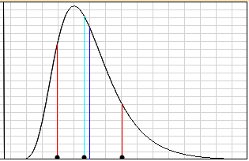

= There Is No Spoon
2020-03-13
Tony Baines
:docinfo: shared
:source-highlighter: highlightjs
:icons: font
:revealjs_theme: black
:revealjs_slideNumber: h.v
:revealjs_hash: true
:revealjs_history: true
:revealjs_plugin_pdf: enabled
:showNotes: "separate-page"

== Computers can't count

=== ... they can't add / subtract
[source,java]
----
int i = 2147483647;
println(i + 1); //-2147483648 (overflow)

int i = -2147483648;
println(i - 1); // 2147483647 (underflow)
----

=== ... they can't multiply / divide

[source,java]
----
// JShell REPL
1/3    =    0 // Integer
1/3.0  =    0.3333333333333333 // Double
1/3.0f =    0.33333334 // Float

(1/3.0f) * 3    =    1.0
(1/3.0f) * 3.0f =    1.0 // Float * Float
(1/3.0f) * 3.0  =    1.0000000298023224 // Float * Double
----

[.notes]
--
* IEEE 754 standard for floating point
--

== Time does not exist

* Where does time matter?
** Scheduled and repeating tasks
** Keys with a time component
** Time-outs
** Logging

=== System time
* The clocks on your servers may not agree
* NTP isn't perfect
* May give-up if the offset is too large

=== Tic, tock, tock, tick
[source,java]
----

var timeout = clock.instant().plusSeconds(30);

while(clock.instant().isBefore(timeout)) {
    // wait
}
// Error if timed-out
----

* NTP can 'jump' backwards and forwards to correct system time
** Especially fragile during startup

=== Drift Happens
* Bad firewall config - NTP servers unreachable
* Bad NTP server
* Congested networks (latency)

=== VM pauses
* If your system runs on virtualised hardware
* If your application runs in a GC'd runtime

Time can jump forwards suddenly.

=== Relativity

[source,java]
----
// "06-03-2020" - 6th March
var clientLogin = request.get("login-time");

// "03-06-2020"
var today = getToday();

if (clientLogin != today) throw new StaleSessionException();
----

* Time zones
** your client is in London
** your server is in US / EST

[.notes]
--
* Local sysadmins like logs in local time
* MySQL stores timestamps in the server's timezone
** what about data replicated across geographical zones?
--

== The network isn't reliable

=== Connectivity
* Can break at *any* time
* Packets can be dropped

=== Timeliness
* Packets can be delayed
* The 99th percentile delay can be *huge*

[.notes]
--
* Block threads / memory
--

== Parallel Worlds
* Distributed Systems
* More than one version of 'truth'

=== Split Brains

image::images/splitbrain.png[]

[.notes]
--
* One node is primary - all writes go here
* Server cluster is partitioned
* Clients can still see all nodes
* Which write wins?
--

=== Transactions
[plantuml]
----
Client -> Orders : update order
Client -> Accounts : update balance

Client <-- Accounts : SUCCESS
== Orders crashes ==
----

* Did the order update suceed or not
* How should the client react?

[.notes]
--
* A system can crash at *any* time
--

== You can't trust the logs

* Bad timestamps
* Missing data (disk full, rolled-over midway)

=== Copy-and-paste error handling

[source,java]
----
try {
    // long and complex logic
} catch (IllegalArgumentException e) {
    throw new InternalServerError("Bad input");
}
...
} catch (UnknownHostException: e) {
    throw new InternalServerError("Bad input");
}

// 2020-02-29 [main] ERROR  c.b.services.OrderService - Bad input
----

=== Bad assumptions

[source,java]
----
public Response doWithVersion(String version,
                  Function<ApiVersion, Response> thing)
  try {
      // Throws IAE if not matched
      var apiVersion = ApiVersion.valueOf(version);
      return thing.apply(apiVersion);

  } catch (IllegalArgumentException e) {
      return createErrorResponse(
                      "Unsupported API version: " + version);
  }
}
----

[.notes]
--
* Intent - `valueOf()` throws exception with bad value
* Fine with tests
* BUT wrong reason logged
** `thing.apply(...)` threw IAE in real code
--

== You can't trust upstream

=== Bad data
* Unexpected
* Invalid
* Malicious

=== DoS
* Failures re-tried in a tight loop
* High load passed on
* Inefficient / not caching the cacheable

== You can't trust downstream

=== Slow responses
* Consume your application resources
* Timeout / retry make make it worse (DoS)

=== Bad data
* API changes
* Schema mis-match